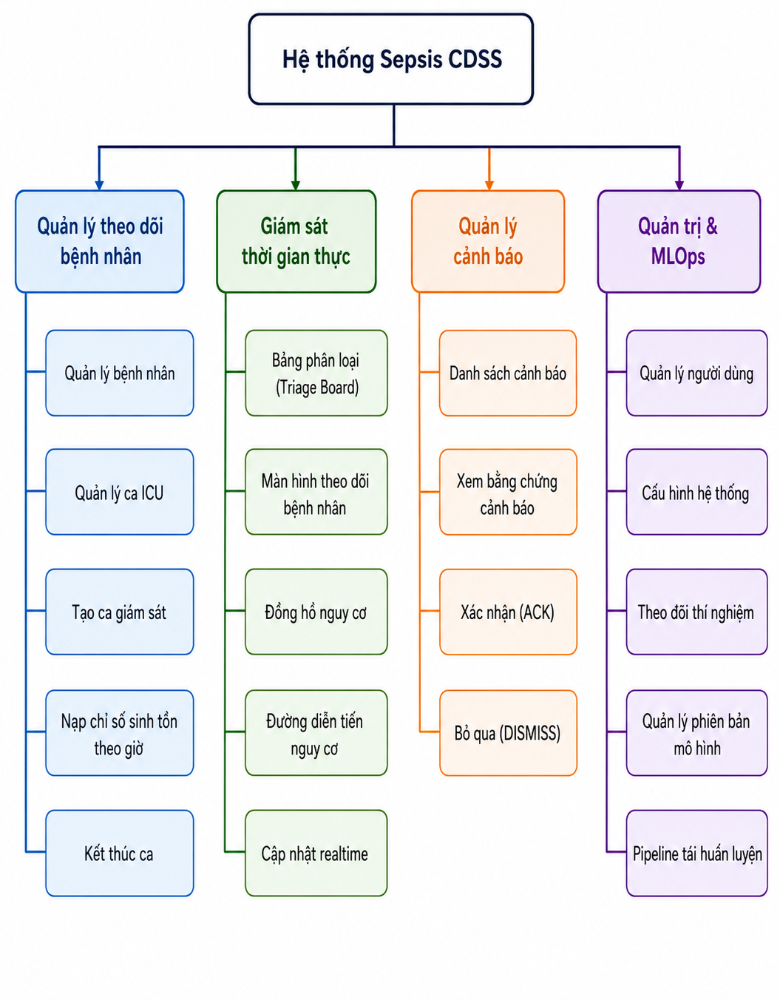
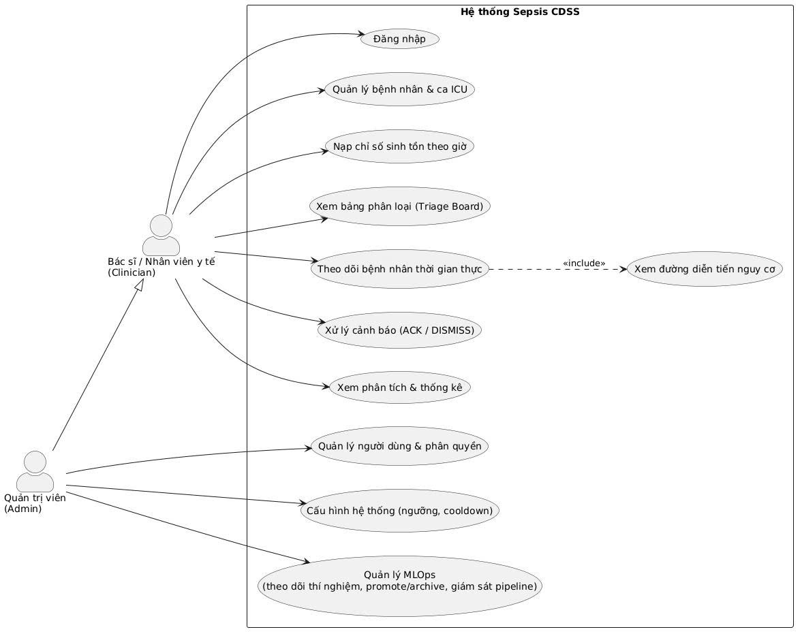
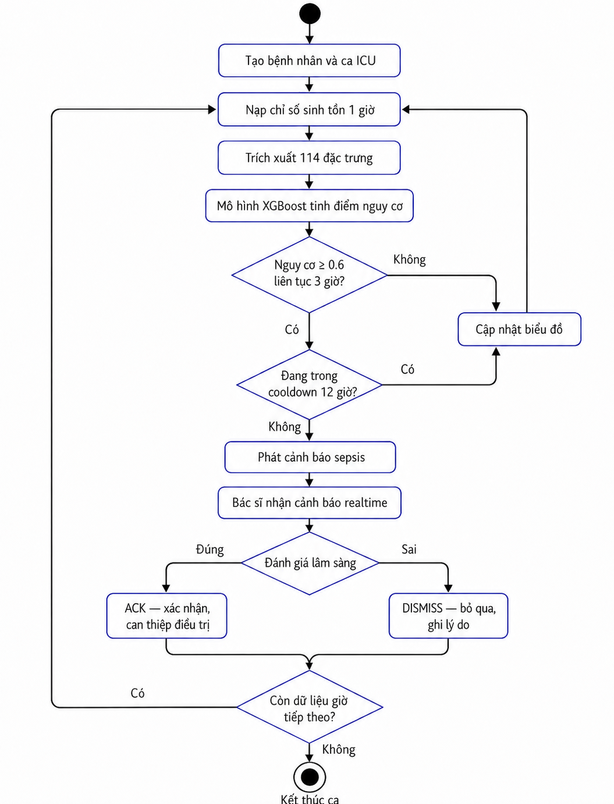
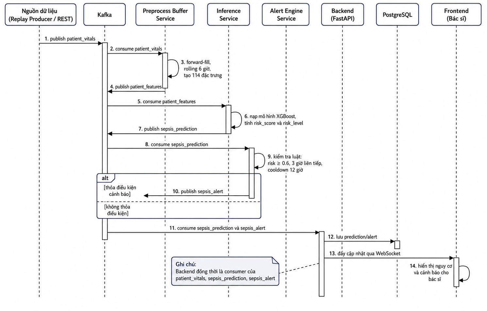
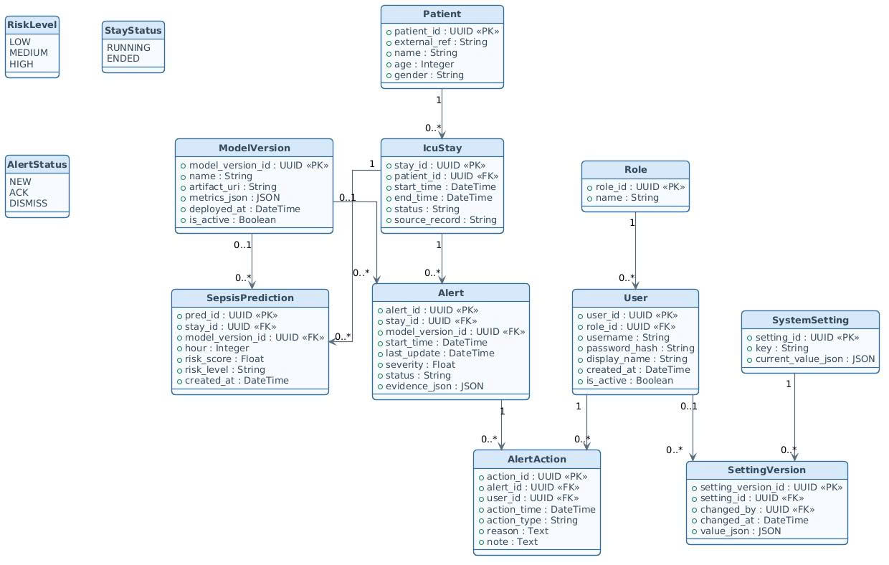
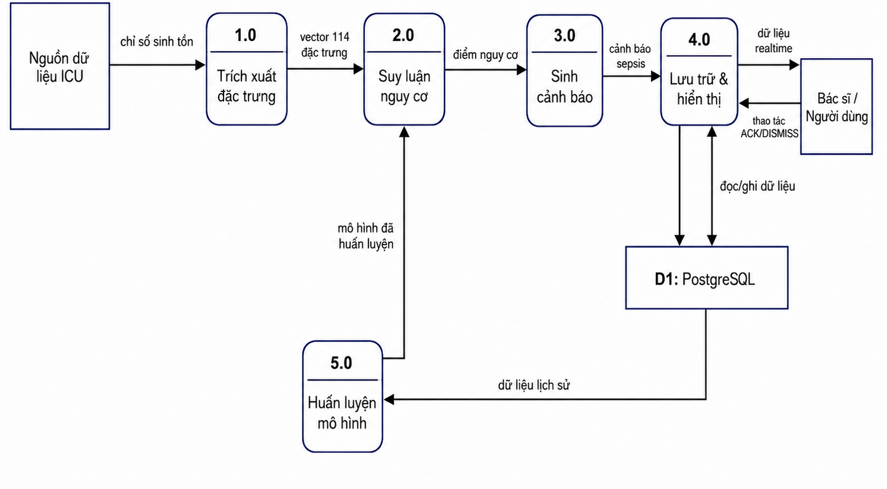
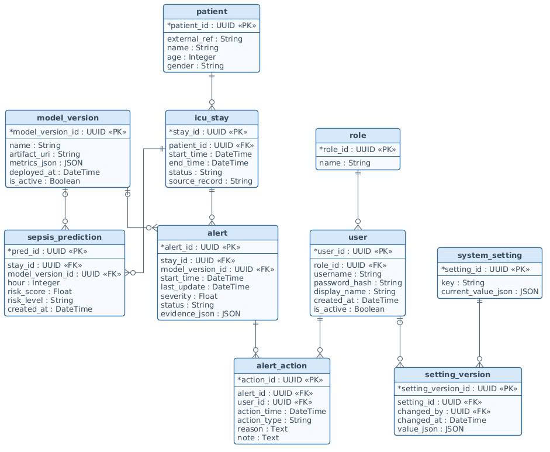
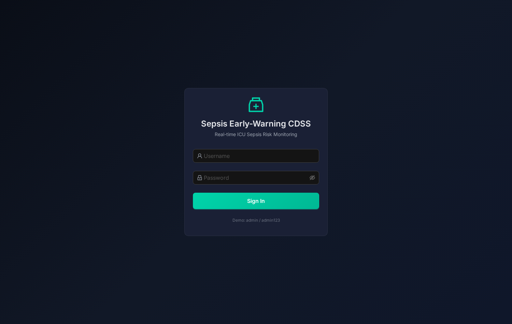
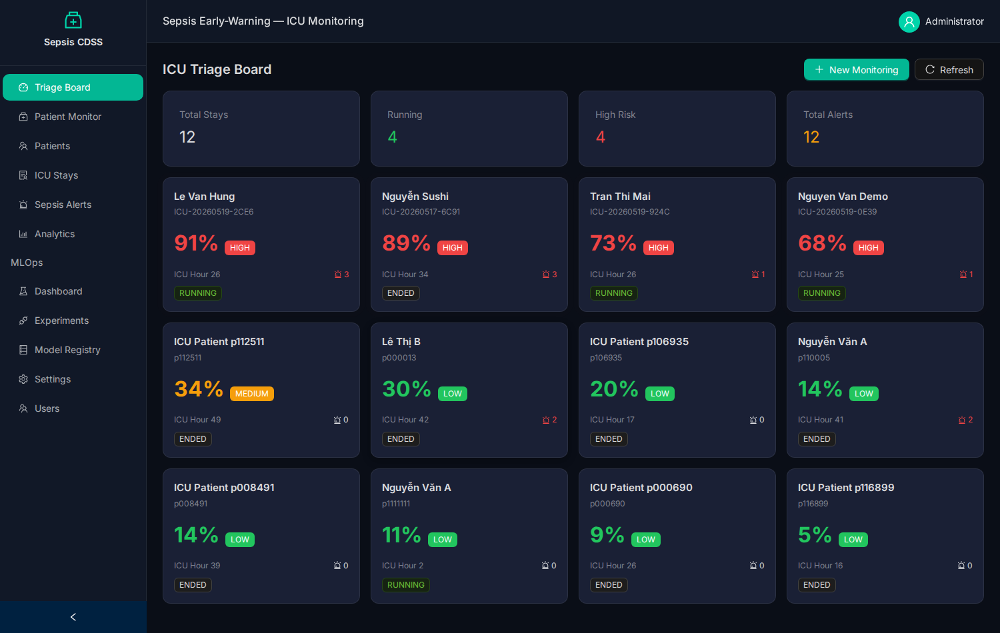
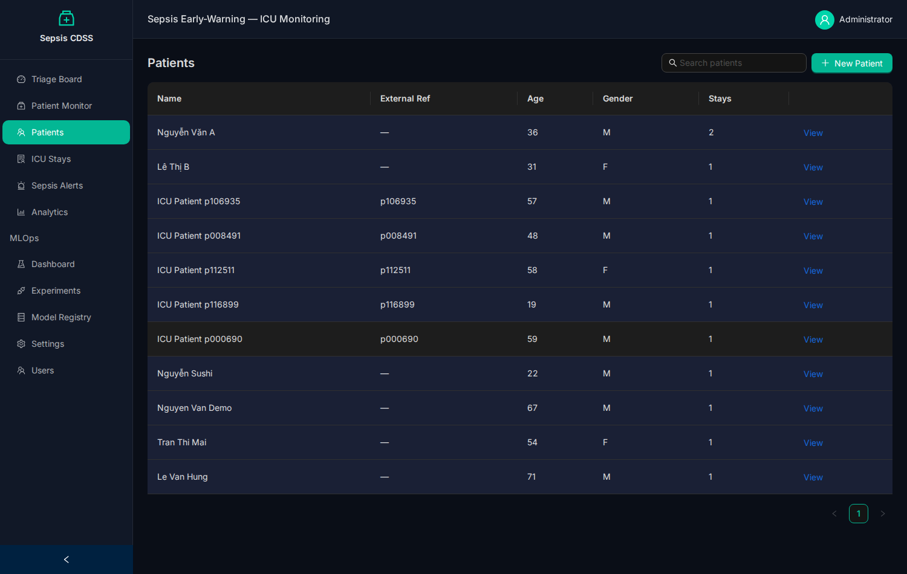

# 🏥 Hệ thống AI thời gian thực hỗ trợ chẩn đoán lâm sàng — Cảnh báo sớm Nhiễm khuẩn huyết (Sepsis Early-Warning CDSS)

> **Trường Đại học Công nghiệp TP. Hồ Chí Minh — Khoa Công nghệ Thông tin**
> Đồ án cuối kì môn **Công nghệ mới trong phát triển ứng dụng**

| | |
|---|---|
| **Giảng viên hướng dẫn** | TS. Bùi Thanh Hùng |
| **Sinh viên thực hiện** | Trần Thái Hà |
| **MSSV** | 22636801 |
| **Lớp** | DHKHDL18A |
| **Khóa** | 18 |

---

## 📑 Mục lục

1. [Giới thiệu và mô tả bài toán](#1-giới-thiệu-và-mô-tả-bài-toán)
2. [Phân tích – Thiết kế](#2-phân-tích--thiết-kế)
3. [Hiện thực](#3-hiện-thực)
4. [Kết luận](#4-kết-luận)
5. [Tài liệu tham khảo](#5-tài-liệu-tham-khảo)

---

## 1. Giới thiệu và mô tả bài toán

**Nhiễm khuẩn huyết (sepsis)** là phản ứng mất kiểm soát của cơ thể trước nhiễm trùng, gây suy
đa cơ quan và là một trong những nguyên nhân tử vong hàng đầu tại khoa Hồi sức tích cực (ICU).
Mỗi giờ chậm trễ trong chẩn đoán làm tăng đáng kể tỷ lệ tử vong — do đó **phát hiện sớm** có ý
nghĩa sống còn.

Đồ án xây dựng một **Hệ thống hỗ trợ quyết định lâm sàng (CDSS)** ứng dụng học máy để **dự đoán
nguy cơ sepsis theo từng giờ** cho bệnh nhân ICU và **cảnh báo sớm** cho nhân viên y tế trước
khi bệnh biểu hiện rõ. Hệ thống hoạt động như một "trợ lý AI" chạy nền:

1. Mỗi **giờ**, nhận chỉ số sinh tồn của bệnh nhân (mạch, huyết áp, nhiệt độ, xét nghiệm…).
2. Trích xuất **114 đặc trưng** chuỗi thời gian.
3. Mô hình **XGBoost** tính **điểm nguy cơ sepsis** (0–1) và mức nguy cơ (LOW/MEDIUM/HIGH).
4. **Bộ luật cảnh báo** phát cảnh báo khi nguy cơ ≥ 0.6 liên tục 3 giờ (cooldown 12 giờ).
5. **Giao diện web** hiển thị nguy cơ và cảnh báo theo thời gian thực cho bác sĩ.

Toàn bộ được xây dựng theo **kiến trúc microservices**, xử lý dữ liệu **streaming thời gian
thực** qua Apache Kafka, kèm quy trình **MLOps** đầy đủ (DVC · Airflow · MLflow) với cơ chế
champion/challenger.

- **Dữ liệu:** PhysioNet/CinC Challenge 2019 (~40.336 bệnh nhân ICU, chỉ số theo từng giờ).
- **Hiệu năng mô hình:** AUROC ≈ **0.84** trên tập đánh giá (validation) giữ riêng theo bệnh nhân.

---

## 2. Phân tích – Thiết kế

### 2.1. Sơ đồ chức năng tổng quát

Hệ thống được phân rã thành **bốn nhóm chức năng**: theo dõi bệnh nhân, giám sát thời gian thực,
quản lý cảnh báo, và quản trị & MLOps.



### 2.2. Biểu đồ trường hợp sử dụng (Use Case)

Hai tác nhân: **Bác sĩ / Nhân viên y tế (Clinician)** và **Quản trị viên (Admin)** — Admin kế
thừa toàn bộ quyền của Clinician và bổ sung các chức năng quản trị, MLOps.



### 2.3. Biểu đồ hoạt động

Luồng nghiệp vụ theo dõi một ca ICU theo từng giờ: nạp chỉ số → trích đặc trưng → dự đoán → áp
luật cảnh báo → bác sĩ xử lý (ACK/DISMISS).



### 2.4. Biểu đồ trình tự

Thứ tự trao đổi thông điệp **bất đồng bộ qua Kafka** giữa các microservice khi xử lý một giờ dữ liệu.



### 2.5. Biểu đồ lớp (Class Diagram)

Cấu trúc tĩnh — các lớp thực thể được hiện thực bằng ORM (SQLAlchemy), tương ứng một-một với các
bảng trong cơ sở dữ liệu.



### 2.6. Biểu đồ luồng dữ liệu (DFD)

Năm tiến trình chính và một kho dữ liệu trung tâm (PostgreSQL); tiến trình huấn luyện đọc dữ liệu
lịch sử để cập nhật mô hình.



### 2.7. Biểu đồ mối quan hệ thực thể (ERD)

10 bảng dữ liệu với khóa chính/khóa ngoại và quan hệ (ký hiệu chân chim).



### 2.8. Thiết kế giao diện

| Đăng nhập | Bảng phân loại (Triage Board) |
|---|---|
|  |  |
| **Màn hình theo dõi bệnh nhân** | **Quản lý cảnh báo** |
|  |  |

### 2.9. Thiết kế giải thuật

**a) Trích xuất đặc trưng:** từ 41 cột chỉ số gốc → forward-fill giá trị thiếu → thống kê cửa sổ
trượt 6 giờ (mean, std, min, max) → đặc trưng độ mới (time-since-last) → **vector 114 đặc trưng**.

**b) Mô hình XGBoost:** phân loại nhị phân (`binary:logistic`), xử lý mất cân bằng lớp bằng
`scale_pos_weight`, dừng sớm dựa trên một phần holdout tách riêng từ tập train (tập val giữ đóng băng).

**c) Luật cảnh báo (cửa sổ trượt):** chỉ phát cảnh báo khi nguy cơ ≥ **0.6** duy trì **3 giờ**
liên tục, kèm **cooldown 12 giờ** để chống quá tải cảnh báo (alert fatigue).


### 2.10. Thiết kế các bộ Test

| Loại kiểm thử | Phạm vi | Ví dụ ca kiểm thử |
|---|---|---|
| Unit test | Hàm/logic độc lập | Luật cảnh báo: đủ 3 giờ trên ngưỡng thì phát, cooldown thì không |
| Test mô hình | Chất lượng XGBoost | AUROC/AUPRC trên tập **val** đạt ngưỡng tối thiểu |
| Integration test | Liên thông service | Nạp 1 giờ chỉ số → phát sinh bản ghi dự đoán |
| Test API | Endpoint REST | Đăng nhập sai / chưa xác thực trả 401 |
| Test phân quyền | RBAC | Clinician gọi endpoint quản trị bị từ chối 403 |
| Test giao diện | Luồng người dùng | Nạp dữ liệu → màn hình cập nhật nguy cơ & cảnh báo |
| Test pipeline MLOps | DVC & Airflow | Chạy pipeline 4 bước tới trạng thái thành công |

---

## 3. Hiện thực

### 3.1. Công nghệ sử dụng

| Tầng | Công nghệ |
|------|-----------|
| **Frontend** | React 18 · TypeScript · Vite · Ant Design · ECharts · TanStack Query · Zustand |
| **Backend** | FastAPI · SQLAlchemy 2.0 (async) · Pydantic v2 · JWT · WebSocket |
| **Streaming** | Python 3.11 · Apache Kafka · confluent-kafka |
| **Machine Learning** | XGBoost · pandas · NumPy · scikit-learn |
| **MLOps** | DVC · MLflow · Apache Airflow |
| **Cơ sở dữ liệu** | PostgreSQL 15 |
| **Hạ tầng** | Docker · Docker Compose · Cloudflare Tunnel |

### 3.2. Dữ liệu

- **Nguồn:** PhysioNet/CinC Challenge 2019 (~40.336 bệnh nhân ICU, chỉ số theo từng giờ, 41 cột).
- **Tải dữ liệu:** `python download_sepsis.py` → giải nén vào `Data/sepsis-2019/`.
- **Chia dữ liệu:** ở **mức bệnh nhân** theo **hàm băm (hash) ổn định** trên mã bệnh nhân, tỷ lệ
  **70/15/15** (`random_seed` trong `params.yaml`). Mỗi bệnh nhân luôn rơi vào cùng một tập kể cả
  khi dữ liệu mở rộng → tránh rò rỉ dữ liệu.
- **Vai trò ba tập:** `train` để huấn luyện · `val` **đóng băng** để đánh giá & cổng promote ·
  `test` dành riêng để **chạy demo trên giao diện** (`data/splits/test_patients.txt`).
- **Vòng lặp dữ liệu vận hành:** ca bệnh đã phục vụ trong hệ thống (đã có nhãn từ `.psv`) được
  gộp vào tập train ở lần tái huấn luyện kế tiếp.

### 3.3. Triển khai hệ thống

#### Kiến trúc tổng thể


Hệ thống gồm **luồng phục vụ trực tuyến** (xử lý dữ liệu bệnh nhân realtime) và **luồng MLOps
offline** (huấn luyện, quản lý mô hình). Mọi service giao tiếp bất đồng bộ qua **Apache Kafka**
với 4 topic: `patient_vitals` · `patient_features` · `sepsis_prediction` · `sepsis_alert`.

| Service | Vai trò |
|---------|---------|
| **replay-producer** | Phát lại dữ liệu `.psv` mô phỏng thiết bị theo dõi ICU |
| **preprocess-buffer-service** | Đệm lịch sử theo ca, trích xuất 114 đặc trưng |
| **inference-service** | Nạp mô hình XGBoost, tính điểm nguy cơ sepsis |
| **alert-engine-service** | Áp luật cảnh báo, sinh cảnh báo sepsis |
| **backend** | FastAPI: REST API, WebSocket, Kafka consumer, ORM |
| **frontend** | Giao diện web React |
| **kafka / postgres** | Hàng đợi tin nhắn / Cơ sở dữ liệu |
| **mlflow / airflow** | Theo dõi thí nghiệm & registry / Tự động tái huấn luyện |
| **cloudflared** | Cloudflare Tunnel — đưa frontend ra domain công khai |

#### Sơ đồ triển khai (Docker Compose)


#### Yêu cầu

- **Docker** + **Docker Compose** (chạy toàn bộ hệ thống).
- **RAM** khuyến nghị ≥ 8 GB (đầy đủ ~11 container).
- Bộ dữ liệu **PhysioNet/CinC 2019** (tải ở bước dưới).

#### Bước 1 — Clone mã nguồn

```bash
git clone https://github.com/HaTranThai/Clinical-Decision-Support-System.git
cd Clinical-Decision-Support-System
```

#### Bước 2 — Tải dữ liệu

```bash
python download_sepsis.py          # tải ~40.000 file .psv vào Data/sepsis-2019/
```

#### Bước 3 — Cấu hình biến môi trường

```bash
cp .env.example .env               # giá trị mặc định đã chạy được cho local
```

Các biến chính trong `.env`:

| Biến | Mặc định | Ý nghĩa |
|------|----------|---------|
| `POSTGRES_*` | sepsis_admin / sepsis_secret_2024 | Thông tin kết nối PostgreSQL |
| `KAFKA_BOOTSTRAP_SERVERS` | kafka:9092 | Địa chỉ Kafka broker |
| `SECRET_KEY` | change-me… | Khóa ký JWT — **đổi khi triển khai thật** |
| `ACCESS_TOKEN_EXPIRE_MINUTES` | 480 | Thời hạn token đăng nhập |
| `MLFLOW_TRACKING_URI` | http://mlflow:5000 | Địa chỉ MLflow tracking |
| `MODEL_CHECKPOINT` | artifacts/sepsis_model.json | Mô hình inference phục vụ |
| `N_PATIENTS` / `SEPSIS_RECORD` / `HOUR_INTERVAL_SEC` | 5 / "" / 1.0 | Cấu hình replay-producer |
| `ALERT_RISK_THRESHOLD` / `SUSTAINED_HOURS` / `COOLDOWN_HOURS` | 0.6 / 3 / 12 | Tham số luật cảnh báo |
| `CLOUDFLARE_TUNNEL_TOKEN` | (trống) | **Tùy chọn** — chỉ cần khi expose ra domain qua Cloudflare Tunnel |

#### Bước 4 — Chạy (chọn 1 trong các cách)

**Cách A — Toàn bộ hệ thống** (cần điền `CLOUDFLARE_TUNNEL_TOKEN`, hoặc bỏ service `cloudflared`):

```bash
docker compose up -d
docker compose ps                  # tất cả service nên ở trạng thái "running"
```

**Cách B — Chỉ phần lõi (khuyến nghị cho local, nhẹ RAM, không cần tunnel):**

```bash
docker compose up -d postgres kafka mlflow backend frontend \
  preprocess-buffer inference-service alert-engine
```

**Cách C — Bật thêm MLOps tự động (Airflow):**

```bash
docker compose up -d airflow-webserver airflow-scheduler
```

**Cách D — Expose ra domain (tùy chọn):** điền `CLOUDFLARE_TUNNEL_TOKEN` vào `.env` rồi:

```bash
docker compose up -d cloudflared
```

> Lần đầu chạy mất vài phút để Docker build image.

**Dừng hệ thống:**

```bash
docker compose stop     # dừng container
docker compose down     # dừng & xóa container
docker compose down -v  # xóa cả volume (reset toàn bộ dữ liệu)
```

#### Truy cập

| Giao diện | Địa chỉ | Tài khoản |
|-----------|---------|-----------|
| **Ứng dụng web** | http://localhost:13000 | `admin` / `admin123` |
| MLflow | http://localhost:15000 | — |
| Airflow | http://localhost:18080 | `admin` / `admin123` |
| API docs (Swagger) | http://localhost:18800/docs | — |

**Cổng dịch vụ:** Frontend `13000→3000` · Backend `18800→8000` · MLflow `15000→5000` ·
Airflow `18080→8080` · PostgreSQL `15432→5432` · Kafka `9092`.

> **Dùng VS Code Remote / máy chủ từ xa:** mở tab **PORTS** → "Forward a Port" → nhập `13000`.

#### Quy trình MLOps

Pipeline **4 bước**, chạy thủ công (DVC) hoặc tự động theo lịch (Airflow — DAG
`sepsis_daily_retrain`, 02:00 hằng ngày):

```
prepare_data → train → evaluate → compare_and_register
```

| Bước | Mô tả |
|------|-------|
| `prepare_data` | Trích đặc trưng, chia hash 70/15/15, gộp dữ liệu vận hành từ PostgreSQL |
| `train` | Huấn luyện XGBoost (scale_pos_weight, early stopping), log lên MLflow |
| `evaluate` | Đánh giá AUROC/AUPRC trên tập **val** giữ đóng băng |
| `compare_and_register` | So champion/challenger, cổng `min_auroc`, đăng ký Model Registry |

```bash
python -m venv .venv && source .venv/bin/activate
pip install -e mlops
export MLFLOW_TRACKING_URI=http://localhost:15000
dvc repro
```

#### Kiểm thử & Demo

**1) Demo luồng realtime — bơm một bệnh nhân test vào hệ thống.** Chọn bệnh nhân thuộc **tập
test** (mô hình chưa học → trung thực); danh sách ở `data/splits/test_patients.txt`:

```bash
# Cách 1: dùng script push_patient (cần: pip install requests)
python tools/push_patient.py \
  --patient-name "Demo Test Patient" \
  --psv "data/splits/test/p000003.psv" \
  --interval 5 --stop

# Cách 2: phát qua replay-producer (chạy nhanh)
docker compose run --rm -e SEPSIS_RECORD=p000003 -e HOUR_INTERVAL_SEC=0.5 replay-producer
```

Sau đó mở http://localhost:13000 → đăng nhập → xem **đồng hồ nguy cơ**, **đường diễn tiến** và
**cảnh báo** cập nhật theo thời gian thực.

**2) Demo vòng lặp MLOps — tái huấn luyện trên dữ liệu vận hành.** Sau khi đã chạy ≥ 1 bệnh nhân
test ở trên (ca đó được ghi vào DB), trigger pipeline:

```bash
docker compose exec airflow-scheduler airflow dags unpause sepsis_daily_retrain
docker compose exec airflow-scheduler airflow dags trigger sepsis_daily_retrain
```

Theo dõi trên Airflow (http://localhost:18080) và MLflow (http://localhost:15000): xuất hiện
phiên bản mô hình mới, các ca test đã phục vụ được gộp vào tập train.

**3) Chạy bộ kiểm thử tự động (backend):**

```bash
docker compose exec backend pytest            # chạy trong container backend
# hoặc local: cd backend && pip install -r requirements.txt && pytest
```

**4) Các loại kiểm thử** (chi tiết xem mục [2.10](#210-thiết-kế-các-bộ-test)): unit test luật cảnh
báo, test chất lượng mô hình (AUROC trên val), integration test liên thông service, test API,
test phân quyền (RBAC), test giao diện, test pipeline MLOps.

### 3.4. Kết quả của các module

| Quản lý theo dõi bệnh nhân | Giám sát thời gian thực |
|---|---|
|  |  |
| **Quản lý cảnh báo** | **Bảng điều khiển MLOps** |
|  |  |

### 3.5. Đánh giá, thảo luận kết quả

- Mô hình XGBoost đạt **AUROC ≈ 0.84** trên tập val giữ riêng theo bệnh nhân — đủ tốt cho bài
  toán cảnh báo sớm; AUPRC thấp phản ánh đặc thù dữ liệu mất cân bằng (tỷ lệ dương ~1.8%).
- Hệ thống vận hành **thông suốt đầu-cuối**: dữ liệu chảy qua toàn bộ chuỗi microservice, hiển
  thị nguy cơ và cảnh báo realtime; pipeline MLOps tái huấn luyện và promote/archive mô hình tự động.
- Luật cảnh báo cửa sổ trượt + cooldown giảm hiệu quả hiện tượng quá tải cảnh báo.

---

## 4. Kết luận

### 4.1. Kết luận

Đồ án đã xây dựng hoàn chỉnh một hệ thống CDSS cảnh báo sớm sepsis: kết hợp **mô hình học máy
hiệu quả** (XGBoost, AUROC ≈ 0.84) với **kiến trúc phần mềm hiện đại** (microservices + Kafka)
và **quy trình MLOps bài bản** (DVC · Airflow · MLflow, champion/challenger, vòng lặp dữ liệu vận
hành). Hệ thống chứng minh tính khả thi và hữu ích của việc tự động hóa toàn bộ vòng đời mô hình
cho bài toán y tế thời gian thực.

### 4.2. Hướng phát triển

- Bổ sung chức năng cho bác sĩ **xác nhận nhãn** trên UI để khép kín vòng dữ liệu vận hành thật.
- Giám sát **trôi dữ liệu (data drift)** để tự kích hoạt tái huấn luyện.
- Mở rộng quy mô bằng Kubernetes, tối ưu bộ nhớ pipeline huấn luyện.
- Thử nghiệm thêm mô hình chuỗi thời gian (LSTM/Transformer) để so sánh.

---

## 5. Tài liệu tham khảo

[1] Apache Software Foundation, "Apache Airflow Documentation", https://airflow.apache.org/docs/.

[2] Apache Software Foundation, "Apache Kafka Documentation", https://kafka.apache.org/documentation/.

[3] Breiman, L. (2001), "Random Forests", *Machine Learning*, 45(1), 5–32.

[4] Chawla, N. V., Bowyer, K. W., Hall, L. O., Kegelmeyer, W. P. (2002), "SMOTE: Synthetic Minority Over-sampling Technique", *Journal of Artificial Intelligence Research*, 16, 321–357.

[5] Chen, T., Guestrin, C. (2016), "XGBoost: A Scalable Tree Boosting System", *Proceedings of the 22nd ACM SIGKDD International Conference on Knowledge Discovery and Data Mining (KDD '16)*, 785–794.

[6] DVC – Iterative, "Data Version Control Documentation", https://dvc.org/doc.

[7] Fleuren, L. M., et al. (2020), "Machine learning for the prediction of sepsis: a systematic review and meta-analysis of diagnostic test accuracy", *Intensive Care Medicine*, 46, 383–400.

[8] Friedman, J. H. (2001), "Greedy Function Approximation: A Gradient Boosting Machine", *The Annals of Statistics*, 29(5), 1189–1232.

[9] Goldberger, A. L., et al. (2000), "PhysioBank, PhysioToolkit, and PhysioNet: Components of a New Research Resource for Complex Physiologic Signals", *Circulation*, 101(23), e215–e220.

[10] Henry, K. E., Hager, D. N., Pronovost, P. J., Saria, S. (2015), "A targeted real-time early warning score (TREWScore) for septic shock", *Science Translational Medicine*, 7(299).

[11] Hochreiter, S., Schmidhuber, J. (1997), "Long Short-Term Memory", *Neural Computation*, 9(8), 1735–1780.

[12] Islam, M. M., et al. (2019), "Prediction of sepsis patients using machine learning approach: A meta-analysis", *Computer Methods and Programs in Biomedicine*, 170, 1–9.

[13] Komorowski, M., Celi, L. A., Badawi, O., Gordon, A. C., Faisal, A. A. (2018), "The Artificial Intelligence Clinician learns optimal treatment strategies for sepsis in intensive care", *Nature Medicine*, 24, 1716–1720.

[14] Kreps, J., Narkhede, N., Rao, J. (2011), "Kafka: a Distributed Messaging System for Log Processing", *Proceedings of the NetDB Workshop*.

[15] Kreuzberger, D., Kühl, N., Hirschl, S. (2023), "Machine Learning Operations (MLOps): Overview, Definition, and Architecture", *IEEE Access*, 11, 31866–31879.

[16] Lundberg, S. M., Lee, S.-I. (2017), "A Unified Approach to Interpreting Model Predictions", *Advances in Neural Information Processing Systems (NeurIPS) 30*.

[17] Merkel, D. (2014), "Docker: Lightweight Linux Containers for Consistent Development and Deployment", *Linux Journal*, 2014(239).

[18] Nemati, S., et al. (2018), "An Interpretable Machine Learning Model for Accurate Prediction of Sepsis in the ICU", *Critical Care Medicine*, 46(4), 547–553.

[19] Newman, S. (2015), *Building Microservices: Designing Fine-Grained Systems*, O'Reilly Media.

[20] PostgreSQL Global Development Group, "PostgreSQL Documentation", https://www.postgresql.org/docs/.

[21] Ramírez, S., "FastAPI Documentation", https://fastapi.tiangolo.com/.

[22] React – Meta Platforms, Inc., "React Documentation", https://react.dev/.

[23] Reyna, M. A., et al. (2020), "Early Prediction of Sepsis from Clinical Data: The PhysioNet/Computing in Cardiology Challenge 2019", *Critical Care Medicine*, 48(2), 210–217.

[24] Rhodes, A., et al. (2017), "Surviving Sepsis Campaign: International Guidelines for Management of Sepsis and Septic Shock 2016", *Intensive Care Medicine*, 43, 304–377.

[25] Saito, T., Rehmsmeier, M. (2015), "The Precision-Recall Plot Is More Informative than the ROC Plot When Evaluating Binary Classifiers on Imbalanced Datasets", *PLoS ONE*, 10(3).

[26] Sculley, D., et al. (2015), "Hidden Technical Debt in Machine Learning Systems", *Advances in Neural Information Processing Systems (NeurIPS) 28*.

[27] Seymour, C. W., et al. (2017), "Time to Treatment and Mortality during Mandated Emergency Care for Sepsis", *The New England Journal of Medicine*, 376, 2235–2244.

[28] Singer, M., et al. (2016), "The Third International Consensus Definitions for Sepsis and Septic Shock (Sepsis-3)", *JAMA*, 315(8), 801–810.

[29] Vaswani, A., et al. (2017), "Attention Is All You Need", *Advances in Neural Information Processing Systems (NeurIPS) 30*.

[30] Zaharia, M., et al. (2018), "Accelerating the Machine Learning Lifecycle with MLflow", *IEEE Data Engineering Bulletin*, 41(4), 39–45.

---

### 📂 Tài liệu chi tiết

- [`docs/architecture.md`](docs/architecture.md) — Kiến trúc hệ thống đầy đủ
- [`docs/mlops.md`](docs/mlops.md) — Quy trình MLOps
- [`docs/runbook.md`](docs/runbook.md) — Sổ tay vận hành
- [`docs/api.md`](docs/api.md) — Tài liệu REST API & WebSocket
- [`docs/BaoCao-CNM.docx`](docs/) — Báo cáo đồ án đầy đủ (theo mẫu)
