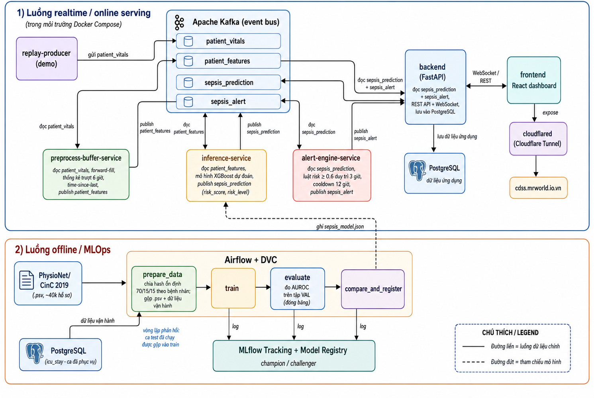
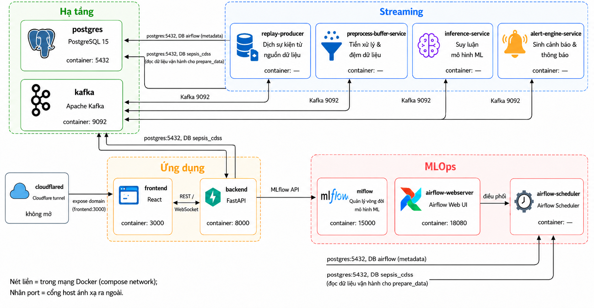
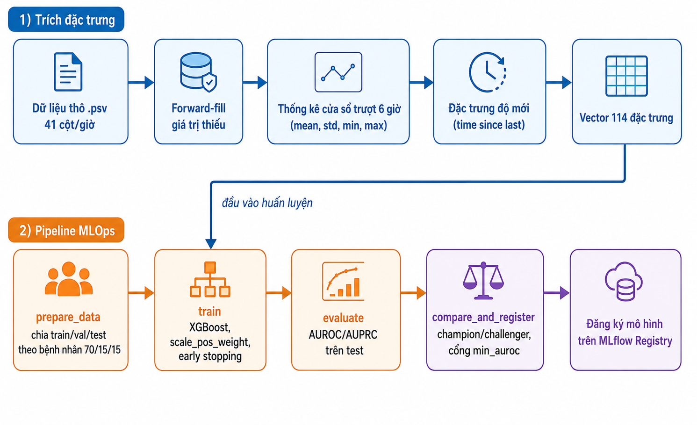
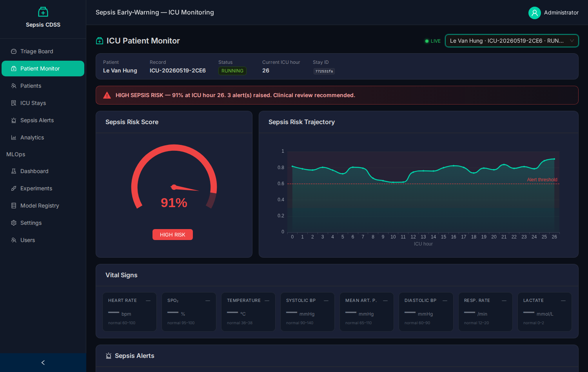
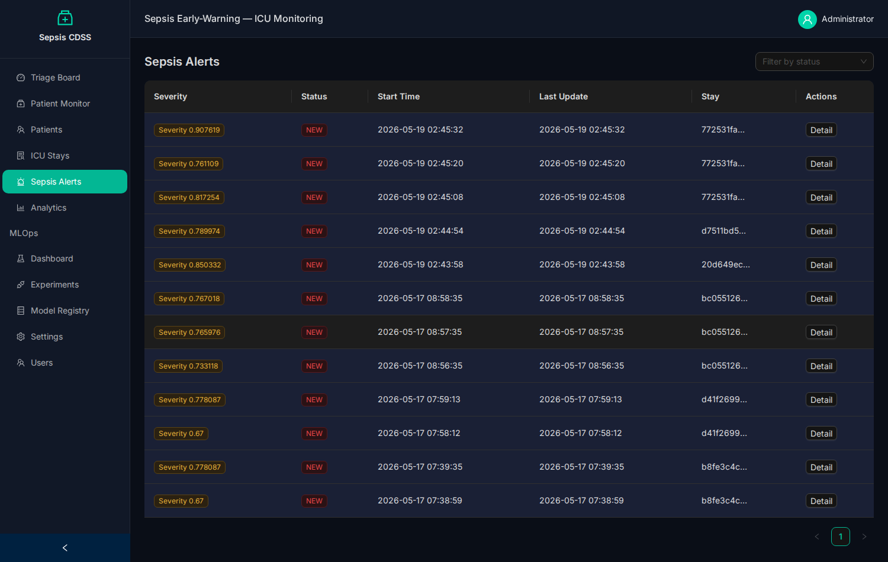
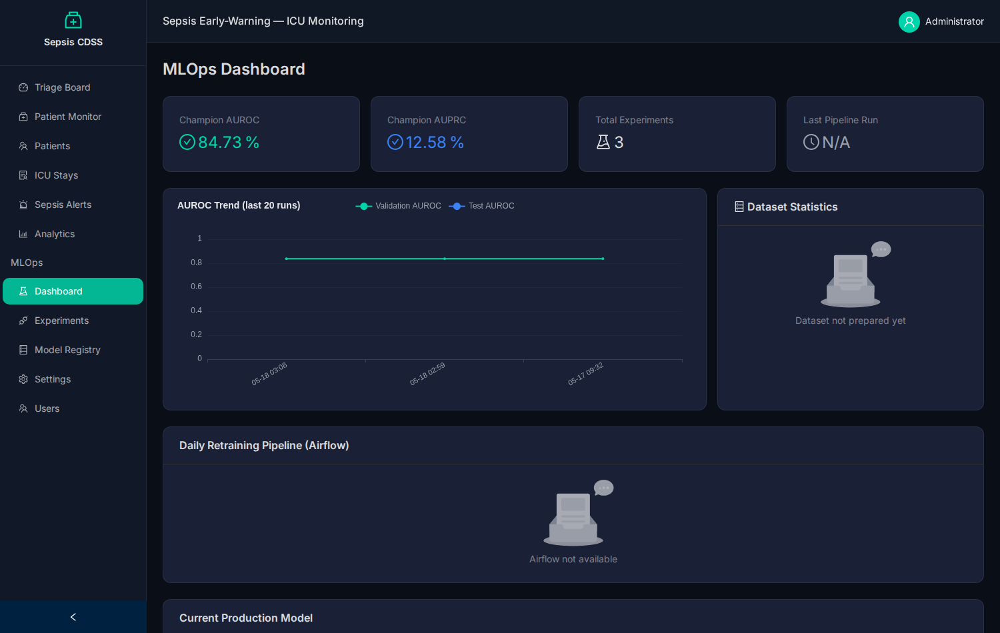

<!-- _paginate: false -->
<!-- _header: '' -->

# Hệ thống AI thời gian thực hỗ trợ chẩn đoán lâm sàng
## Cảnh báo sớm Nhiễm khuẩn huyết (Sepsis Early-Warning CDSS)

**Trường ĐH Công nghiệp TP.HCM — Khoa Công nghệ Thông tin**
Đồ án môn *Công nghệ mới trong phát triển ứng dụng*

|   |   |
|---|---|
| **Giảng viên hướng dẫn** | TS. Bùi Thanh Hùng |
| **Sinh viên thực hiện** | Trần Thái Hà — 22636801 |
| **Lớp / Khóa** | DHKHDL18A — Khóa 18 |

---

## 1. Đặt vấn đề

- **Nhiễm khuẩn huyết (sepsis)**: phản ứng mất kiểm soát của cơ thể trước nhiễm trùng → suy đa cơ quan, **tử vong hàng đầu tại ICU**.
- **Mỗi giờ chậm chẩn đoán → tăng đáng kể tỷ lệ tử vong.**
- Bác sĩ ICU theo dõi nhiều bệnh nhân, khó phát hiện dấu hiệu sớm bằng mắt thường.

**⇒ Mục tiêu:** xây dựng hệ thống **CDSS** dự đoán nguy cơ sepsis **theo từng giờ** và **cảnh báo sớm** cho nhân viên y tế — trước khi bệnh biểu hiện rõ.

---

## 2. Tổng quan giải pháp

Hệ thống chạy nền trong ICU như một "trợ lý AI":

1. Mỗi **giờ** nhận chỉ số sinh tồn (mạch, HA, nhiệt độ, xét nghiệm…).
2. Trích **114 đặc trưng** chuỗi thời gian.
3. Mô hình **XGBoost** → điểm nguy cơ (0–1) + mức (LOW/MEDIUM/HIGH).
4. **Luật cảnh báo**: nguy cơ ≥ 0.6 duy trì 3 giờ (cooldown 12 giờ).
5. **Giao diện web** hiển thị nguy cơ + cảnh báo **realtime** cho bác sĩ.

> Kiến trúc microservices · streaming Kafka · MLOps đầy đủ (DVC · Airflow · MLflow).

---

## 3. Kiến trúc tổng thể



**Hai luồng:** online serving (xử lý realtime) và offline MLOps (huấn luyện, quản lý mô hình).

---

## 4. Luồng realtime — Event-driven qua Kafka

```
replay-producer → patient_vitals → preprocess-buffer → patient_features
   → inference-service → sepsis_prediction → alert-engine → sepsis_alert
   → backend (lưu DB + WebSocket) → frontend
```

| Service | Vai trò |
|---|---|
| replay-producer | Nguồn phát (mock thiết bị) → `patient_vitals` |
| preprocess-buffer | Trích 114 đặc trưng → `patient_features` |
| inference-service | XGBoost dự đoán → `sepsis_prediction` |
| alert-engine | Luật cảnh báo → `sepsis_alert` |
| backend | REST + **WebSocket** realtime + lưu PostgreSQL |

---

## 5. Triển khai



- Đóng gói toàn bộ bằng **Docker Compose** — khởi động 1 lệnh.
- **Cloudflare Tunnel** đưa hệ thống ra domain công khai (`cdss.mrworld.io.vn`).

---

## 6. Dữ liệu

- **Nguồn:** PhysioNet/CinC Challenge 2019 — **~40.336 bệnh nhân ICU**, chỉ số theo từng giờ, **41 cột**.
- **Trích đặc trưng → 114 đặc trưng:**
  - Forward-fill giá trị thiếu.
  - Thống kê **cửa sổ trượt 6 giờ** (mean, std, min, max).
  - Đặc trưng **độ mới** (time-since-last-measured).



---

## 7. Chia dữ liệu & Quy trình MLOps

- **Chia theo hash ổn định 70/15/15** ở mức bệnh nhân (tránh rò rỉ, ổn định khi mở rộng).
  - **train** → huấn luyện · **val** → đánh giá/cổng promote (đóng băng) · **test** → demo UI.
- **Vòng lặp vận hành:** ca đã phục vụ (có nhãn) → gộp vào train lần retrain sau.
- **Pipeline 4 bước:** `prepare_data → train → evaluate → compare_and_register`.
  - **DVC** (thủ công, tái lập) · **Airflow** (tự động 02:00) · **MLflow** (champion/challenger, cổng `min_auroc`).

---

## 8. Mô hình Machine Learning

- **XGBoost** (`binary:logistic`) — phù hợp dữ liệu dạng bảng, train nhanh, giải thích được.
- **Mất cân bằng lớp** (~1.8% dương) → `scale_pos_weight`.
- **Dừng sớm** trên holdout cắt từ train; **val** giữ đóng băng để đánh giá trung thực.
- **Luật cảnh báo cửa sổ trượt + cooldown** → chống quá tải cảnh báo (alert fatigue).

| Siêu tham số | Giá trị |
|---|---|
| max_depth / eta | 6 / 0.05 |
| subsample / colsample | 0.8 / 0.8 |
| num_boost_round | 600 (early stopping) |

---

## 9. Kết quả — Giao diện

<div style="display:flex; gap:12px;">


</div>

- Theo dõi realtime (gauge nguy cơ, đường diễn tiến), quản lý cảnh báo (ACK/DISMISS), bảng điều khiển MLOps — hoạt động đầy đủ.

---

## 10. Kết quả — Mô hình & Hệ thống

- **AUROC ≈ 0.84** trên tập **val** giữ riêng theo bệnh nhân.
- Hệ thống chạy **thông suốt đầu-cuối**: dữ liệu qua toàn chuỗi microservice, hiển thị nguy cơ + cảnh báo realtime.
- Pipeline MLOps **tự động** tái huấn luyện và register/promote mô hình.



---

## 11. Kết luận & Hướng phát triển

**Kết luận**
- Xây dựng hoàn chỉnh CDSS cảnh báo sớm sepsis: ML hiệu quả + microservices + streaming + **MLOps bài bản**.
- Chứng minh tính khả thi của tự động hóa vòng đời mô hình cho y tế realtime.

**Hướng phát triển**
- Bác sĩ **xác nhận nhãn** trên UI → khép kín vòng dữ liệu vận hành.
- Giám sát **trôi dữ liệu (drift)** → tự kích hoạt retrain; bổ sung **CI/CD**.
- Mở rộng cụm (Kubernetes, Kafka nhiều broker); thử LSTM/Transformer.

---

<!-- _paginate: false -->

# Cảm ơn thầy và các bạn đã lắng nghe!

**Trần Thái Hà — 22636801 — DHKHDL18A**
GVHD: TS. Bùi Thanh Hùng

*Demo: https://cdss.mrworld.io.vn*
